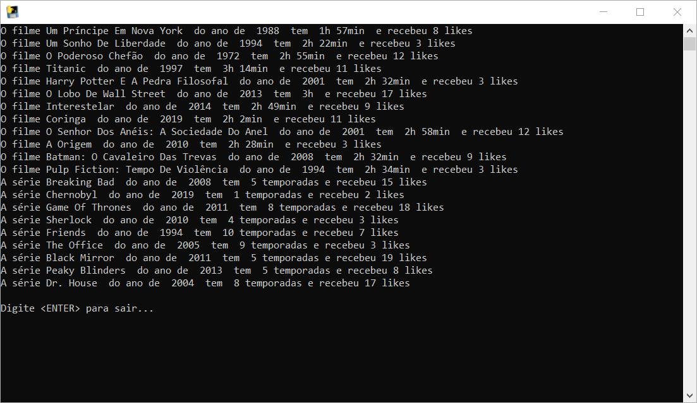
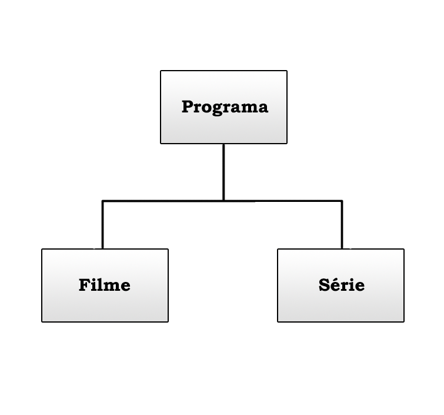

<h1 align="center">Orientação a objetos em Python</h1>

O projeto de listagem foi desenvolvido em Python 3, com a orientação dos cursos <b><i>Python 3: Introdução a Orientação a objetos</i></b> e 
<b><i>Python 3: Avançando na orientação a objetos</i></b> da plataforma ALURA.
Esse projeto aborda o paradigma de orientação a objetos, como atributo, métodos, classes, encapsulamento, herança, herança múltipla e polimorfismo.

 

 <table style="width:100%" border="0px">
  <tr>
    <td></td>
    <td></td>
  </tr>
</table> 

 
Executável para teste: ./dist/principal.exe
